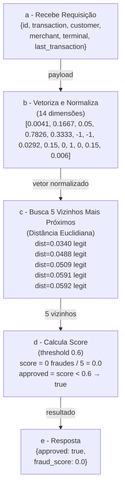
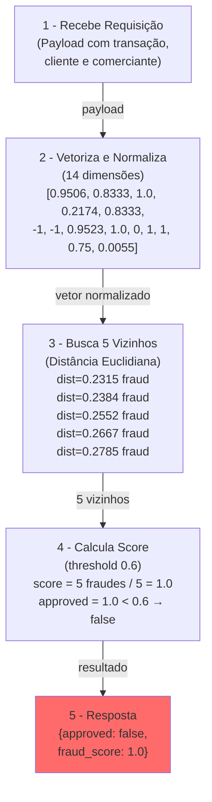

### 1 - Qual objetivo?
Construir API que transforma o payload em vetor, busca no dataset de referencia transações mais parecidas e decide se aprova ou nega.

### 2 - Como será a API?

#### 2.1 Quais endpoints?

Com dois endpoints na porta 9999
- GET / Ready - Responde com HTTP 2xx quando estiver pronta para teste
- POST / fraud-score - Este precisa ter o formato de payload que vai receber requisições das transações dessa forma estrutural

#### 2.2 Como será o formato do payload de receber?
```json
{
  "id": "tx-3576980410",
  "transaction": {
    "amount": 384.88,
    "installments": 3,
    "requested_at": "2026-03-11T20:23:35Z"
  },
  "customer": {
    "avg_amount": 769.76,
    "tx_count_24h": 3,
    "known_merchants": ["MERC-009", "MERC-001", "MERC-001"]
  },
  "merchant": {
    "id": "MERC-001",
    "mcc": "5912",
    "avg_amount": 298.95
  },
  "terminal": {
    "is_online": false,
    "card_present": true,
    "km_from_home": 13.7090520965
  },
  "last_transaction": {
    "timestamp": "2026-03-11T14:58:35Z",
    "km_from_current": 18.8626479774
  }
}
```

#### 2.3 - Como deve ser o formato de resposta da API?
```json
{
  "approved": false,
  "fraud_score": 1.0
}
```
**Obs: no teste, cada requisição envia um payload individual**


### 3 - Quais são as regras de decisão do retorno da requisição (se aprovado ou não e o score)?

As regras nas quais a API deve transformar a requisição num vetor de 14 dimensões, buscar no dataset as 5 mais parecidas e, a partir daí, decidir se a nova transação é fraudulenta.

#### 3.1 - Como é o fluxo da transação?



### 4 - Como são as 14 dimensões do vetor em ordem e as regras para normalização destas?

| índice | dimensão                 | fórmula                                                                          |
|-----|--------------------------|----------------------------------------------------------------------------------|
| 0   | `amount`                 | `limitar(transaction.amount / max_amount)`                                         |
| 1   | `installments`           | `limitar(transaction.installments / max_installments)`                             |
| 2   | `amount_vs_avg`          | `limitar((transaction.amount / customer.avg_amount) / amount_vs_avg_ratio)`        |
| 3   | `hour_of_day`            | `hora(transaction.requested_at) / 23`  (0-23, UTC)                               |
| 4   | `day_of_week`            | `dia_da_semana(transaction.requested_at) / 6`    (seg=0, dom=6)                  |
| 5   | `minutes_since_last_tx`  | `limitar(minutos / max_minutes)` ou `-1` se `last_transaction: null`             |
| 6   | `km_from_last_tx`        | `limitar(last_transaction.km_from_current / max_km)` ou `-1` se `last_transaction: null` |
| 7   | `km_from_home`           | `limitar(terminal.km_from_home / max_km)`                                          |
| 8   | `tx_count_24h`           | `limitar(customer.tx_count_24h / max_tx_count_24h)`                                |
| 9   | `is_online`              | `1` se `terminal.is_online`, senão `0`                                           |
| 10  | `card_present`           | `1` se `terminal.card_present`, senão `0`                                        |
| 11  | `unknown_merchant`       | `1` se `merchant.id` não estiver em `customer.known_merchants`, senão `0` (invertido: `1` = desconhecido) |
| 12  | `mcc_risk`               | `mcc_risk.json[merchant.mcc]` (valor padrão `0.5`)                               |
| 13  | `merchant_avg_amount`    | `limitar(merchant.avg_amount / max_merchant_avg_amount)`                           |

Importante mencionar que aqui temos o *clamp* com a função limitar(x) para manter os valores dentro do intervalo `[0.0, 1.0]`

### 5 - Como lidar com o caso do `last_transaction: null`?

Nesse caso, a API deve usar o valor sentinela `-1` nessas duas posições  `minutes_since_last_tx` e `km_from_last_tx`. Esse `-1` é o único caso em que o vetor pode conter um valor fora do intervalo `[0.0, 1.0]`, e serve justamente para distinguir "ausência de dado" de um valor normalizado próximo de zero.

### 6 - Como a decisão é tomada?

Após o vetor pronto, a API deve

1. Buscar, no dataset de referência, os 5 vetores mais próximos do vetor da transação de acabou de chegar;
2. Calcular `fraud_score` como a fração de fraudes entre essas 5 referências — ou seja, `número_de_fraudes / 5`.
3. Responder `approved = fraud_score < 0.6`. O threshold de `0.6` é fixo.

Aqui há liberdade para escolher qualquer algoritmo/técnica de busca vetorial.

Não usar os payloads de teste como referencia ou para fazer lookup de fraudes

### 7 - Exemplo de transação fraudulenta

Para contrastar com o caso legítimo da visão geral, veja como fica uma transação fraudulenta: valor alto, longe de casa, em um comerciante desconhecido, sem histórico de transação anterior. Para o formato completo do payload, veja [API.md](./API.md).

```
1. recebe a requisição:
    {
      "id": "tx-3330991687",
      "transaction":      { "amount": 9505.97, "installments": 10, "requested_at": "2026-03-14T05:15:12Z" },
      "customer":         { "avg_amount": 81.28, "tx_count_24h": 20, "known_merchants": ["MERC-008", "MERC-007", "MERC-005"] },
      "merchant":         { "id": "MERC-068", "mcc": "7802", "avg_amount": 54.86 },
      "terminal":         { "is_online": false, "card_present": true, "km_from_home": 952.27 },
      "last_transaction": null
    }
          ↓
2. vetoriza e normaliza (14 dimensões — note os `-1` nos índices 5 e 6 por conta do `last_transaction: null`):
    [0.9506, 0.8333, 1.0, 0.2174, 0.8333, -1, -1, 0.9523, 1.0, 0, 1, 1, 0.75, 0.0055]
          ↓
3. busca os 5 vizinhos mais próximos:
    dist=0.2315  fraud
    dist=0.2384  fraud
    dist=0.2552  fraud
    dist=0.2667  fraud
    dist=0.2785  fraud
          ↓
4. calcula o score (threshold 0.6):
    score = 5 fraudes / 5 = 1.0
    approved = score < 0.6 → false
          ↓
5. resposta:
    {
      "approved": false,
      "fraud_score": 1.0
    }
```



A busca vetorial nesse caso pretende responder à pergunta:

> *"Dada esta transação nova, quais transações do histórico mais se aproximam dela?"*

### 8 Quais exemplos de métricas para medir semelhanças dos vetores?

O exemplo acima usa **distância euclidiana**, mas ela é apenas uma das opções para medir "quão parecidos são dois vetores". As mais comuns são:

- **Euclidiana** — $\sqrt{\sum_i (q_i - r_i)^2}$. A "distância em linha reta" no espaço. Intuitiva e normalmente usada como ponto de partida.
- **Manhattan** (L1) — $\sum_i |q_i - r_i|$. Soma das diferenças absolutas. Mais barata de calcular (sem raiz nem multiplicação) e penaliza outliers de forma mais suave.
- **Cosseno** — compara o **ângulo** entre os vetores, não o tamanho. Útil quando o que importa é a "direção" do vetor, e não a magnitude (textos, embeddings, etc.).

### KNN exato vs ANN (Approximate Nearest Neighbors)

A forma mais simples de encontrar os K vizinhos mais próximos é o **KNN exato por força bruta**: percorrer todas as referências, calcular a distância para cada uma e ordenar. Funciona, mas custa O(N * D) (D = dimensão dos vetores) por consulta — com 3 milhões de referências e um orçamento de latência apertado, pode ser caro demais.

**ANN** é uma alternativa: estruturas de dados que abrem mão de um pouco de precisão para responder mais rápido. Algumas famílias:

- **HNSW** (Hierarchical Navigable Small World) — grafo em camadas. É o que pgvector, Qdrant e a maioria dos bancos vetoriais usam por padrão. Consulta em **`O(log N)`**.
- **IVF** (Inverted File Index) — particiona o espaço em "células" e busca apenas nas mais próximas da consulta. Consulta em **`O(√N)`** com particionamento típico.
- **LSH** (Locality-Sensitive Hashing) — funções de hash que colidem para vetores parecidos. Consulta em **`O(N^ρ)`** com `ρ < 1` (sub-linear; depende do fator de aproximação).

Existem também outras formas de realizar **busca exata** sem usar força bruta:

- **KD-Tree** (K-Dimensional Tree) – Divide o espaço usando hiperplanos ortogonais. Em cada nível, escolhe um eixo e divide os pontos pela mediana.
- **VP-Tree** (Vantage Point Tree) – Divide o espaço usando distâncias esféricas. Escolhe um ponto fixo e separa os demais entre "dentro" ou "fora" de um raio circular.
- **Ball Tree** – Agrupa pontos em hiperesferas aninhadas. Ao contrário da KD-Tree, as regiões (bolas) podem se sobrepor, mas são mais eficientes em dimensões ligeiramente maiores.
- **Cover Tree** – Organiza os dados em uma hierarquia de níveis baseada em escalas de distância (geralmente potências de 2).
- **BK-Tree** (Burkhard-Keller Tree) – Especializada para distâncias discretas (valores inteiros). Organiza os nós com base na distância exata de cada filho para o pai.


#### Qual abordagem usar nesta Rinha de Backend?

Você pode usar **força bruta, KNN exato, ANN, banco vetorial, modelo de IA treinado, uma sequência de IF/ELSE** ou qualquer outra coisa. O que você precisa encontrar é o equilíbrio entre a precisão da busca vetorial e a performance — a estratégia fica a seu critério.

### 8 - Qual a arquitetura e as restrições para construção da API de busca de vetores para detecção de fraudes?

 O essencial é ter um load balancer distribuindo carga de forma igual (round-robin simples) entre **pelo menos** duas instâncias de API. Mas também pode usar banco, middleware,outras instancias, etc.

O load balancer não pode aplicar regra de negócio, mas só distribuir requisições entre as instâncias


 ```mermaid
flowchart LR
    Client[cliente] --> LB[load balancer]
    LB --> API1[api 1]
    LB --> API2[api 2]
```

### 8.1 Como a solução deve ser entregue?

A sua solução deve ser entregue como um arquivo `docker-compose.yml`. Todas as imagens declaradas nele devem estar publicamente disponíveis.

A soma dos limites de recursos de todos os serviços declarados no `docker-compose.yml` deve ser de, no máximo, **1 CPU e 350 MB de memória**. Você distribui esse total entre os serviços como preferir. Exemplo de como declarar o limite de um serviço:

```yml
services:
  seu-servico:
    ...
    deploy:
      resources:
        limits:
          cpus: "0.15"
          memory: "42MB"
```

- A entrega deve estar na branch `submission` do seu repositório

- A porta para responder precisa ser a *9999* onde o load balancer é que recebe as requisições.

- As imagens devem ser compatíveis com `linux-amd64`

- O modo de rede deve ser `bridge`. O modo `host` não é permitido.

- O modo `privileged` não é permitido.

